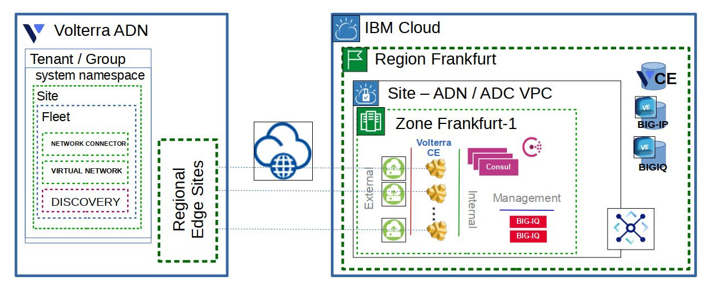

# ibm-adn-adc-tier-demo

This Schematics Workspace module lifecycle manages:

- IBM VPC Gen2 VPC
- IBM VPC Subnets within the created VPC
- IBM Custom Images for

    - Volterra CE Generic Hardware
    - F5 BIG-IP
    - F5 BIGIQ

- Consul Cluster VSIs
- Volterra CE VSI (optional)
- Volterra Site
- Volterra Fleet
- Volterra Network Connector to the global shared/public network
- Volterra Virtual Network exporting routes to IBM Transit Gateway networks
- Votlerra Discovery for Consul VSIs
- BIGIQ VSIs (optional)

The application of this Workspace module results in the necessary Volterra system namespace resources required to connect workloads routable via IBM Transit Gateways to the Volterra ADN. The output includes the CA certificate and the Consul client access token to register services with the Consul cluster which in-turn becomes available by service name to the Volterra ADN.
### Required values
Fill in the following values, based on the steps that you completed before you began.

| Key | Definition | Value Example |
| --- | ---------- | ------------- |
| `region` | The VPC region that you want your BIG-IP™ to be provisioned. | us-south |
| `instance_name` | The name of the VNF instance to be provisioned. | f5-ve-01 |
| `hostname` | The hostname you want your BIG-IP™ to be provisioned. | f5-ve-01 |
| `domain` | The domain you want your BIG-IP™ to be provisioned. | local |
| `tmos_image_name` | The name of the VNF image  | bigip-15-1-2-0-0-9-all-1slot |
| `instance_profile` | The profile of compute CPU and memory resources to be used when provisioning the BIG-IP™ instance. To list available profiles, run `ibmcloud is instance-profiles`. | cx2-4x8 |
| `ssh_key_name` | The name of your public SSH key to be used. Follow [Public SSH Key Doc](https://cloud.ibm.com/docs/vpc-on-classic-vsi?topic=vpc-on-classic-vsi-ssh-keys) for creating and managing ssh key. | linux-ssh-key |
| `management_subnet_id` | The ID of the management subnet where the instance will be deployed. Click on the subnet details in the VPC Subnet Listing to determine this value | 0717-xxxxxx-xxxx-xxxxx-8fae-xxxxx |
| `external_subnet_id` | The ID of the external subnet where the instance listens for virtual services. Click on the subnet details in the VPC Subnet Listing to determine this value | 0717-xxxxxx-xxxx-xxxxx-8110-xxxxx |

### Optional values
Fill in the following values, based on the steps that you completed before you began.

| Key | Definition | Value Example |
| --- | ---------- | ------------- |
| `tmos_admin_password` | The password to set for the BIG-IP™ admin user. | valid TMOS password |
| `cluster_subnet_id` | The ID of the management dedicated to configsync operations. Click on the subnet details in the VPC Subnet Listing to determine this value | 0717-xxxxxx-xxxx-xxxxx-8fae-xxxxx |
| `internal_subnet_id` | The ID of the internal subnet where the instance will communicate to internal resources. Click on the subnet details in the VPC Subnet Listing to determine this value | 0717-xxxxxx-xxxx-xxxxx-8fae-xxxxx |
| `do_declaration_url` | The URL to retrieve the f5-declarative-onboarding JSON declaration  | https://declarations.s3.us-east.cloud-object-storage.appdomain.cloud/do_declaration.json |
| `as3_declaration_url` | The URL to retrieve the f5-appsvcs-extension JSON declaration  | https://declarations.s3.us-east.cloud-object-storage.appdomain.cloud/as3_declaration.json |
| `ts_declaration_url` | The URL to retrieve the f5-telemetry-streaming JSON declaration  | https://declarations.s3.us-east.cloud-object-storage.appdomain.cloud/ts_declaration.json |
| `phone_home_url` | The URL for post onboarding web hook  | https://webhook.site/#!/8c71ed42-da62-48ea-a2a5-265caf420a3b |
| `tgactive_url` | The URL to POST L3 device configurations when TMOS tgactive script is executed |
| `tgstandby_url` | The URL to POST L3 device configurations when TMOS tgstandby script is executed |
| `tgrefresh_url` | The URL to POST L3 device configurations when TMOS tgrefresh script is executed |
| `app_id` | Application ID used for CI integration | a044b708-66c4-4f50-a5c8-2b54eff5f9b5 |

